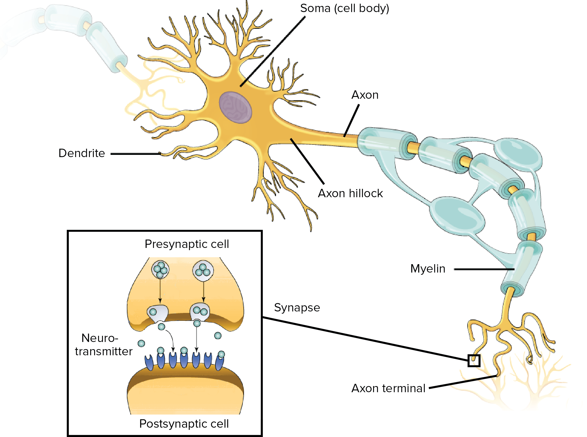
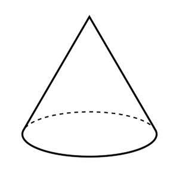
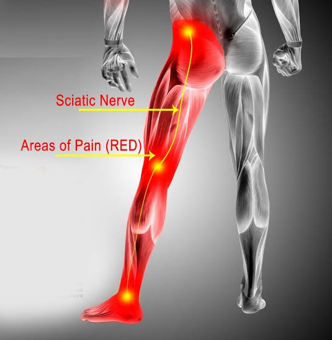
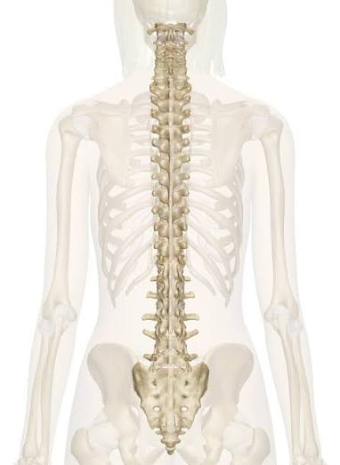
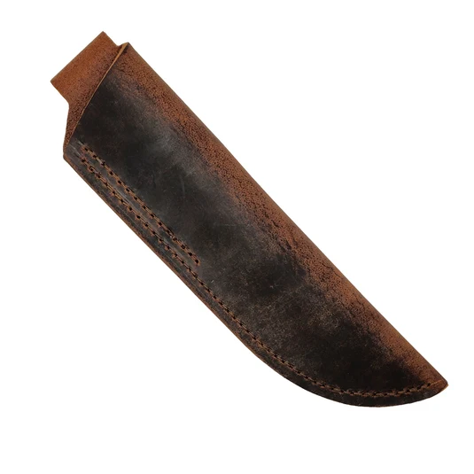
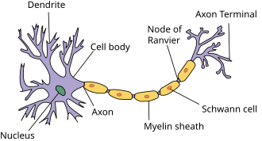
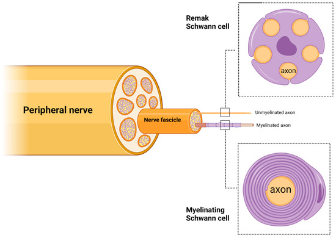
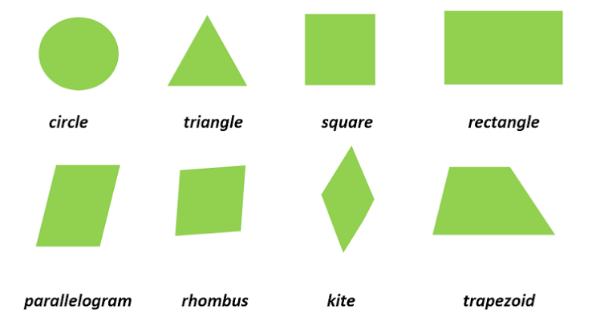

# Lesson 1 
## Chapter 1

> **`Glial:`** **non-neuronal cells** in the nervous system that **support**, **protect**, and **maintain** the environment for neurons.

> **`Roughly:`** about, around

> **`Specialized Cells:`** cells that have **developed** specific **shapes and structures** to perform a **particular job** in an organism.

> **`Somatic:`** relates to the **physical body**, especially as distinct from the mind

> **`transmit:`** pass, send, or transfer something—such as signals, information, or diseases—from one person, place, or thing to another

> **`electrochemical:`** the **chemical reactions** that either **produce** an **electric `current`** or are **caused by** an electric current
>
> - **current:** the **flow** of electric charge through a `conductor`
>   - **Conductor:** a material that allows **electricity** or **heat** to **flow through** it easily, whereas an **`insulator`** **prevents** or greatly **restricts** (limit) that flow

> **`Neurons:`** biologically designed to **receive**, **process**, and **transmit** electrochemical signals.

> **`come in:`** means "have/has", **how things naturally exist** or are usually offered

> **`diverse:`** different, variety

> **`virtually:`** nearly, almost

> **`morphological:`** relates to the **structure, shape, or form** of something, such as the structure of words in language or the physical forms of living organisms

> **`components:`** **modular (model like) , reusable (could use again) building blocks** uses to construct larger systems, software applications, or user interfaces

> **`Dictate:`** authoritatively **order** or command something, or to **say words aloud for someone else to write down**.

> **`Motor Neuron:`** a speciallized **nerve cell** that transmits **electrical signals** from the **brain and `spinal cord` **to **muscles and glands** to control voluntary and involuntary **movements**
>
> - **spinal cord:** a long, **tube-like band** of tissue that **connects animal's brain to the lower back**, carrying `vital` nerve signals back and `forth` between the brain and the rest of the body
>   - **vital:** absolutely necessary, very important, or **essential to life**
>   - **forth:** moving for**ward**, onward, or out into view
> - **glands:** organs in the body that **create and release chemical**, such as hormones, sweat (on the skin), or saliva (in the mouth), **to help the body function properly**
> - **Voluntary:** doing something willingly, **by choice, and without being forced or paid**

---

> **`Dendrites:`** The tree branch-like structures of a neuron that **receive signals** from other nerve cells and **transmit them to the cell body**

> **`Cell body (soma):`** the core part of a neuron that contains the nucleus and acts as the cell's **life support and command center**

> **`Axon hillock:`** specialized **part of a neuron's cell body** that connects to the axon and acts as the decision-making site where nerve **`impulses`** are generated
>
> - **impulse:** sudden, strong, and **unthinking urge or desire to act**

> **`Axon:`** long, slender part of a nerve cell that **conducts electrical** impulses **away from the cell body**

> **`Myelin:`** fatty substance that **wraps around nerve`fibers`** to ``insulate`` them and **speed up the transmission** of **electrical signals** throughout the nervous system.
>
> - **Fiber:** refers to **thread-like structures** that can be found in plants (as dietary fiber - could help with `digestion`), in animal tissues (like muscle or `collagen` fibers), or created ``synthetically`` for ``textiles``. 
>   - **digestion:** the process by which the animal's body **breaks down food into nutrients** (e.g., amino acid) to **use for energy, growth, and cell repair** 
>
>   - **collagen:** Major structural **proteins** found in the **skin**, bones, and tissues that **provides strength and ``elasticity``**
>     - **elasticity:** the ability of an object or material to **`stretch` or `deform` and then return to its original shape**
>       - **stretch:** **extend** or lengthen objects
>       - **deform:** **change** the natural **shape, form, or structure** of something
>
>   - **synthetically:** something is **made artifically through chemical or digital** processes rather than occurring (happening) naturally
>
>   - **textile:** Any type of **cloth or fabric made by `weaving`, `knitting`, or `felting` fibers together**
>     - **weaving:** a method of **textile production** where **two** distinct sets of **`yarns` or threads** are **`interlaced`** at right angles to **form a fabric or cloth**
>       - **yarn:** the **thick thread** used for knitting and weaving
>
>       - **interlaced:** **technique** where two or more things are **woven, crossed, or combined together in an `alternating` pattern**
>         - **alternating:** **changing back and forth repeately** between two different things, states, or actions
>
>     - **knitting:** constructs **fabric by interlocking a single continuous yarn** using needle
>
>     - **felting:** process of **`matting`, `condensing`, and pressing fibers**—usually wool (from sheep)—together to create a `dense` fabric
>       - **matting:** **felting or tangling** of **fabers** on a fabric's **surface**
>       - **condensing:** the process of **making something shorter, smaller, or more `concentrated`**
>         - **concentrated:** a lot **substance or effort** is **gathered into one small space or focused on one single point**
>       - **dense:** having parts that are **closely packed together, making it thick, heavy, or crowded**
> - **insulate:** to protect something by surrounding it with a material that prevents the loss of heat, or stops electricity or sound from passing through.
> - *formed by ***oligodendrocytes*** in the **central nervous system**, where a **single cell** can wrap (pack) around **multiple axons**
> - formed by **Schwann cells** in the **`peripheral` nervous system**, where each cell wraps around only a single axon **segment** (a part of an axon)
>   - **peripheral:** something that is on the **edge or outer boundary** of an area, rather than in the center
>   - **segment:** a distinct **part, section, or pieces** of something larger, or the act of **dividing a whole into such parts.**

> **`Axon terminal:`** the botton-like **end of a neuron's axon** that **releases `neurotransmitters`** to **communicate** with other neurons 
>
> - **`neurotransmitter: `chemical** messenger that **transmits information between nerve cells** throughout animal's body

> **Metabolic:** relating to the **chemical precesses** in living cells that **turn nutrients into energy and support life**

> **integration:** **combining** different parts into a single, unified (identical, consistent) system

> **Potential:** the **possibility** of becoming something **great** in the **future**.

> **Antennas:** `metallic` devices that **send and receive radio waves and transmit data**
>
> - **metallic:** relating to, containing, or `resembling` **metal**
>   - **resembling:** looking like or being **similar to** someone or something

> **Projection:** A part that **`sticks` out** from a surface
>
> - **stick:** refers to **thin pieces of wood** that have fallen from trees, or **long, thin pieces** of something

> **Adjacent:** something that is **next to, `adjoining`, or sharing a common border** with another object or area
>
> - **adjoin:** next to or **joined with** something

> **Operational:** refers to anything is **ready for use, actively functioning**, or related to the **day-to-day working of a system**, machine, business etc.

> **Headquarter:** the **main office, central center, or core location** from which an organization, company, or militart unit is **managed and controlled** 

> **Lie: locate** in/on

> **House:** contain, **give...residence** or space

> **Cone:**
>

 

> **Junction:** a **point** where **two or more things** join, meet, or **cross**

> **Tallying up:** means **calculating the total score, amount, or number of something**. It involves (needs) adding **multiple items together to find the final sum**

> **Excitatory:**  a process or substance that **`stimulates` or increases activity in a biological system**, particularly within the nervous system
>
> - **stimulate: `arousing`, increasing, or `accelerating` acticity** with a biological, mechanical, or economic system
>
>   - **arousing:** defines the act of **awakening, `stimulating`**, or **bringing a specific feeling, physical state, or response into existence**
>
>     - **stimulating:** an agent or action that **`encourages`, `quickens` or temporary increases the activity ** of physiological or mental process
>
>       - **encourage:** the act of **`fostering`, supporting, or increasing the `likelihood`** of an action, behavior, or development 
>         - **fostering:** **promoting** the **growth, development, or `cultivation` of a specific idea**, feeling, skill, or condition
>           - **cultivation:** The act of **preparing, tending, or developing** land, crops (plant, the plant to eat), skills, or relationships to promote growth and improvement 
>         - **likelihood:** the **probability or chance** of a specific event, outcome, or state occurring (happening)
>
>       - **quicken:** make or become more **faster**
>
>   - **accelerating:** donates the process of increasing speed, velocity (speed), or the rate of progress within a physical system, projects, or development 

> inhibitory: a process, substance, or signal that represses, slows down, or prevent activity within a biological system, particularly the nervous system.
>
> - represses: subdue (bring under) by force

> cumulative: increasing or becoming breater by adding more over a period of time

> critical: extremely important and necessary, expressing careful judgment, or being in a dangerously severe condition.

> extension: an extra part added to something to make it longer, larger, or more complete

> vary: to differ or undergo changes in size, amount, or character from one istance (a single example or occurrence of a particular thing) to another

> circuit: A complete, closed path through which an electrical current can flow

> sciatic: refers to the large nerve that runs from the lower back down the back of each leg, or relates the pain (sciatica) caused by its compression or irritation
>

 

>
> - compression: the process of reducing the size of data or files to save storage space or speed up transmission
> - irritation: a state of feeling annoyed, impatient, or slightly angry, or a painful soreness or inflammation in a part of your body
>   - soreness: a feeling of mild pain or discomfort in muscles or body, usually caused by hard exercise, injury, or illness

> Spine: the row of connected bones down the middle of the back, also known as the backbone
>

 

> dissipating: means to graduslly disappear, scatter, or waste away
>
> - scatter: to separate and go in different directions, or to throw things indifferent directions so they cover an area

> sheath: A close-fitting protective cover or case designed to hold a blade, tool, or instrument
>

 

>
> - close-fitting: something fitting tightly or snugly to the body without being loose or baggy
>   - snugly: fitting closely, warmly, and comfortabaly in a cozy way
>   - loose: not tigltly fitted, firmly fastened, or closely attached to something
>     - firmly: doing something in a strong, steady, and resolute manner that is not easily changed or moved
>       - steady: regular, won't changing or moving suddenly
>         - regular: something that happens at even intervals, or follows a standard, normal pattern
>           - interval: the amount of time or space between two specific points or events
>     - fastened: means firmly closed, joined, or secured in place so that it cannot move or open
>     - attached: connected, joined, or fastened to something else, or feeling a strong emotional fondness for someone or something
>       - fondness: a gentle feeling of affection (like), love, or a strong liking for someone or something
>   - baggy: describes clothing that fits very loosely and hangs away from the body

> discrete: clearly separate, distinct, or unconnected from other things

> segment:  a specific, distinct part or section into which something can be divided

> uninsulated: means not covered or protected with a material that prevents the transfer of heat, electricity, or sound

> Nodes of Ranvier: gaps without myelin but packed with ion channels, where a massive (large and heavy) influx of sodium ions acts like a Minecraft redstone repeater to amplify the signal, while the myelin sheath on either side of the gap keeps the current from leaking out. 
>
> - influx: the sudden arrival or entey of a large number of people or things
> - ion: an atom or molecule that has gained or lost one or more electrons, giving it a net (overall, total, final) positive or negative charge
> - amplify: to increase the strength, volume, or effect of something 
>

 

> *Myelinating Schewann cells: wrap around a single large axon to form a protective and insulating myelin sheath for fast signal conduction
>
> - conduction: the transfer of heat or electricity directly through a material without any movement of the material itself
>
> *Non-myelinating Schwann cells: also called Remak cells, loosely ensheath multiple small-diameter axons together to support and maintain them without forming (to form a, to create/build) myelin
>

 

> - ensheath: enclose, wrap, or cover something completely in a protective case or layer
>
>   - enclose; to surround something on all sides or to put something inside an envelope or package
>
> - diameter: a straight line that passes through the center of a circle and connects two opposite points on its boundary. which is twice the **radius** and can be used to calculate both the circumference (π d) and the area (π r^2) 
>
>   - Circumference: the total distance around the edge of a circle or any curved shape
>     - curved: bending smoothly or having a rounded shape rather than being straight or flat
>
>   - perimeter measures the boundary of straight-sided shaped like a quadrilateral (rectangle, square, parallelogram), trapezoid, triangle etc.
>     

> presence: the state of being physically or mentally present/exist in a place, or the impressive ability to command attention simply by being there, whereas the absence means not there

> fundamentally: menas relating to the most basic, essential, or core nature of something
>
> - essential: absolutely necessary or extremely important

> saltatory: a process of jumping, leaping (same as jumping), or proceeding by abrupt shocks or discontinuous steps, rather than a smooth, continuous movement
>
> - Abrupt: sudden, unexpected, or unceremoniously brief and blunt in speech or manner
>   - unceremoniously: means to do quickly, suddenly, and roughly, without showing any respect or politeness
>   - manner: a way of doing something or a person's way of behaving

